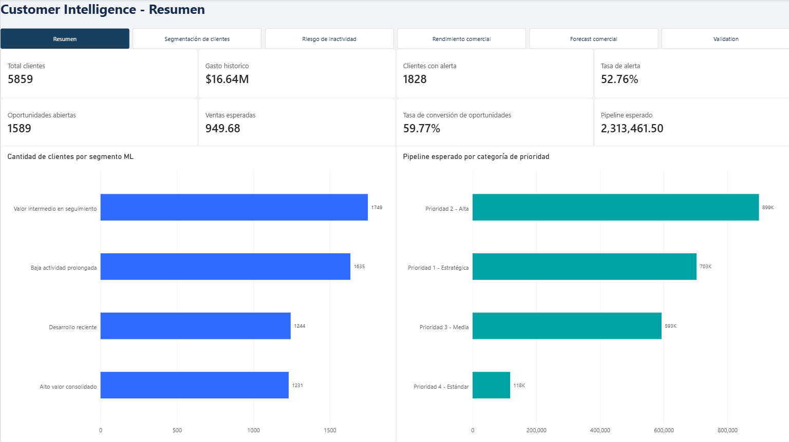
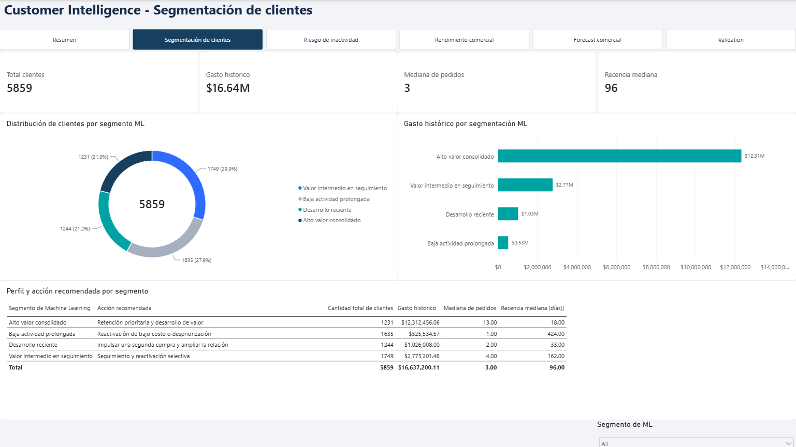
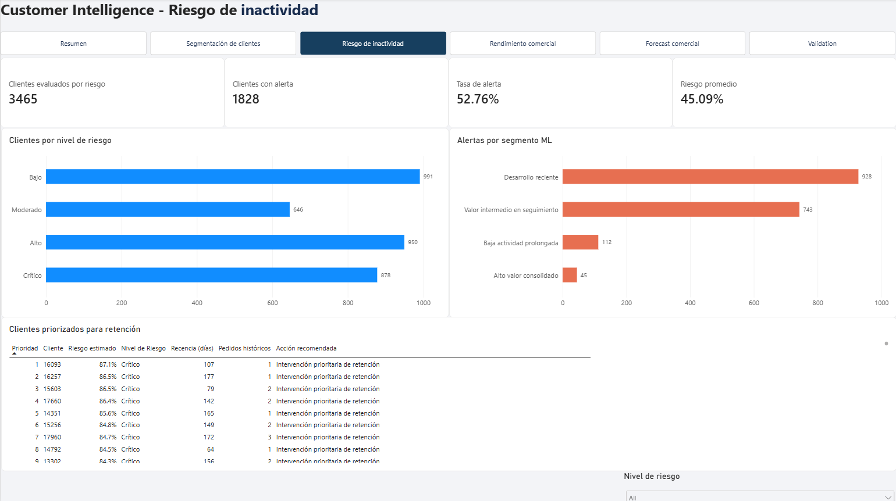
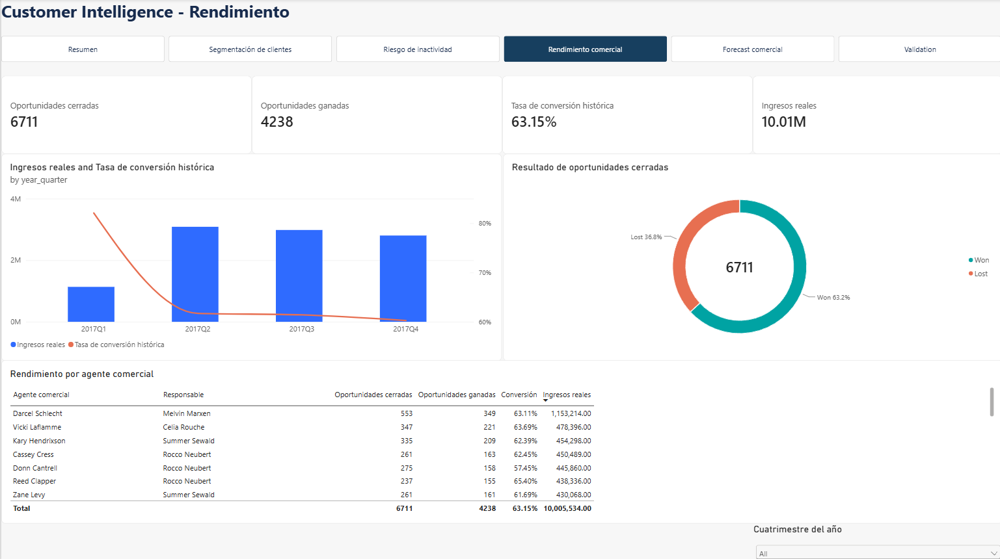
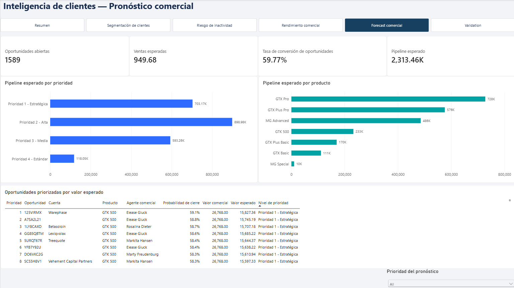
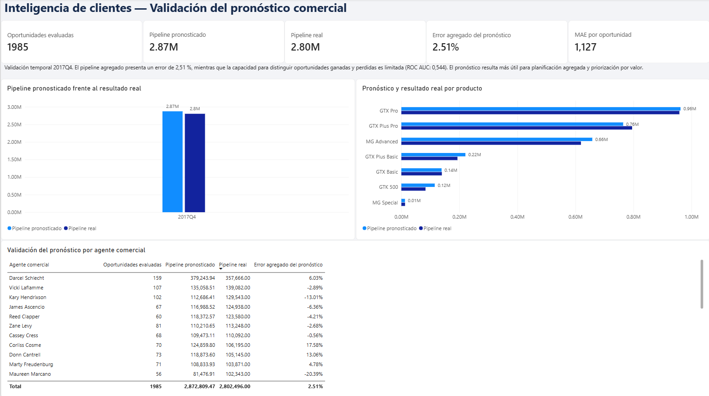

# Customer Intelligence

Proyecto de ciencia de datos orientado a tres decisiones comerciales: segmentar clientes, anticipar su inactividad y estimar el valor esperado de oportunidades abiertas.

El trabajo parte de dos conjuntos de datos públicos e independientes: transacciones de retail y actividad de un CRM. Incluye preparación reproducible, pruebas automatizadas, notebooks de experimentación, modelos reutilizables y un reporte de Power BI.



## Resultados principales

| Módulo | Resultado |
|---|---|
| Segmentación | 5.859 clientes analizados mediante RFM y K-Means. El segmento de alto valor reúne el 21,01 % de los clientes y el 74,01 % del gasto histórico. |
| Inactividad | El modelo de regresión logística alcanzó ROC AUC 0,759 y F1 0,645 en la prueba temporal. El 10 % de mayor riesgo capturó el 19,30 % de los clientes inactivos. |
| Pronóstico comercial | El pipeline del periodo de prueba se estimó con un error agregado de 2,51 %. Las 1.589 oportunidades abiertas representan un valor esperado de 2,31 millones en las unidades de la fuente. |

La segmentación de K-Means fue estable entre distintas inicializaciones, con un ARI medio cercano a 0,997 para cuatro clusters. Su silhouette de 0,294 indica que los perfiles son útiles para análisis comercial, aunque mantienen zonas de solapamiento.

El modelo de inactividad genera una lista operativa de 3.465 clientes elegibles y 1.828 alertas. Para las oportunidades comerciales, la estimación agregada resulta más sólida que la clasificación individual: el ROC AUC de 0,544 muestra una capacidad limitada para separar cierres ganados y perdidos.

## Tablero de Power BI

El reporte reúne seis páginas conectadas mediante un navegador común: Resumen ejecutivo, Segmentación de clientes, Riesgo de inactivida, Rendimiento comercial, Pronóstico comercial y Validación del pronóstico

<p>
  
  
</p>

<p>
  
  
</p>

<p>
  
</p>

El proyecto editable se encuentra en:

```text
reports/power_bi/customer_intelligence.pbip
```

## Flujo del proyecto

```text
Datos raw
   ↓
Validación y preparación
   ↓
Datasets interim y processed
   ↓
Customer 360
   ├── RFM y segmentación ML
   └── Predicción de inactividad

CRM enriquecido
   └── Pronóstico de oportunidades
              ↓
         Power BI
```

Los notebooks conservan la exploración, comparación de modelos y decisiones metodológicas:

```text
notebooks/01_customer_segmentation.ipynb
notebooks/02_inactivity_prediction.ipynb
notebooks/03_opportunity_forecasting.ipynb
```

La lógica utilizada fuera de los notebooks está organizada en `src/customer_intelligence`. Los scripts de `scripts/` regeneran los datasets y resultados operativos, mientras que `tests/` cubre las transformaciones y modelos principales.

## Reproducir el proyecto

El entorno requiere Python 3.14.

```powershell
python -m venv .venv
.venv\Scripts\Activate.ps1
python -m pip install -e ".[dev]"
```

Los archivos de origen deben ubicarse según los contratos documentados en [docs/data_contracts.md](docs/data_contracts.md). Los datos y artefactos generados no se versionan en Git.

La secuencia completa de construcción es:

```powershell
python scripts/build_retail_interim.py
python scripts/build_crm_interim.py
python scripts/build_customer_360.py
python scripts/build_customer_scoring.py
python scripts/build_inactivity_dataset.py
python scripts/build_inactivity_risk.py
python scripts/build_opportunity_datasets.py
python scripts/build_opportunity_forecast.py
python scripts/build_opportunity_forecast_validation.py
```

Validación del código:

```powershell
pytest
ruff check .
git diff --check
```

Las consultas de Power BI utilizan los archivos Parquet generados localmente. Al abrir el proyecto en otro equipo puede ser necesario actualizar sus rutas desde Power Query.

## Tecnologías

Python, pandas, NumPy, scikit-learn, PyArrow, Matplotlib, Jupyter, pytest, Ruff, Power BI, DAX, Power Query, Git y GitHub.

## Documentación

- [Customer 360](docs/customer_360.md)
- [Scoring y segmentación](docs/customer_scoring.md)
- [Predicción de inactividad](docs/customer_inactivity.md)
- [Pronóstico de oportunidades](docs/opportunity_forecasting.md)
- [Factibilidad de los datos](docs/data_feasibility.md)
- [Contratos de datos](docs/data_contracts.md)

## Alcance

Los dos conjuntos de datos representan contextos comerciales distintos y no comparten una clave que permita unir clientes de retail con cuentas del CRM. Por ese motivo, la segmentación y la inactividad se construyen sobre retail, mientras que el pronóstico comercial utiliza exclusivamente el CRM.

Los resultados corresponden a datos históricos públicos y deben interpretarse como una demostración analítica. Las decisiones de negocio requerirían seguimiento periódico, actualización de datos y validación con resultados reales.